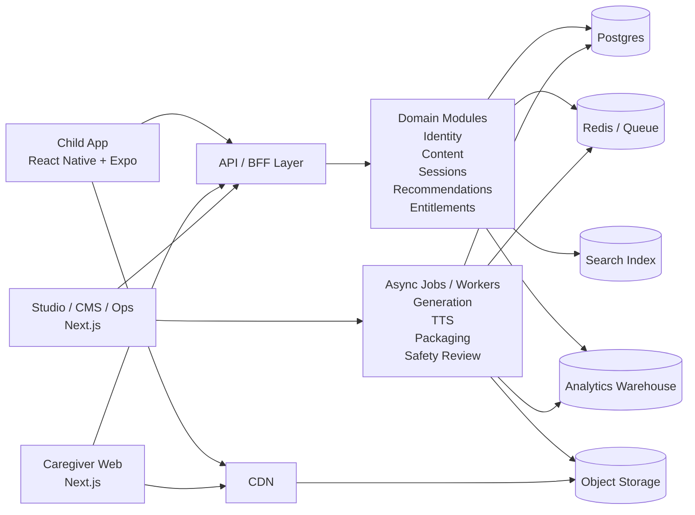
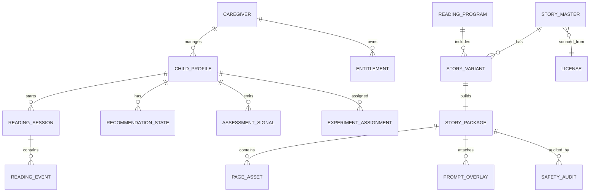

# LumosReading V2 目标架构、契约草案与迁移蓝图

更新日期：2026-03-17

## 1. 文档目标

本文件定义 LumosReading V2 的落地蓝图，回答以下问题：

- V2 的产品形态和系统边界是什么
- 儿童端、家长端、CMS/运营端如何分工
- 领域模型、API 契约、事件契约和存储如何设计
- 未来 6 个月如何交付
- 现有 monorepo 中哪些资产保留、哪些重写、哪些下线

本文件默认以“iPad-first 儿童阅读产品，桌面 Web 为辅助表面”为设计前提。

## 2. V2 产品定义

### 2.1 产品表面

V2 应拆成三个明确表面：

1. `Child App`
   面向儿童，iPad-first，目标是沉浸式阅读、轻互动、音频支持、离线与低打扰。

2. `Caregiver Web`
   面向家长，目标是选书、设置、计划、进展、订阅、提醒和家庭管理。

3. `Studio / CMS / Ops Web`
   面向编辑、审校、运营和客服，目标是内容生产、审核、打包、发布、实验和下架。

### 2.2 非目标

V2 的前 6 个月不建议同时做：

- 开放式“任意生成一本书”
- 面向所有年龄段的全量覆盖
- 学校 LMS 全功能集成
- 重社交、UGC 或儿童社区
- 需要医学验证的治疗型功能

## 3. 推荐技术路线

### 3.1 终端与框架

- `Child App`: React Native + Expo
- `Caregiver Web`: Next.js
- `Studio / CMS / Ops`: Next.js
- `Shared`: TypeScript package for schemas, API client, design tokens, analytics events

为什么不建议继续以 Web 套壳承载儿童主应用：

- iPad-first 体验需要更稳定的触摸与渲染质量
- 离线内容包、音频会话和资源缓存是主需求，不是附加需求
- 后续如果加入 TTS、语音跟读、设备能力和商店分发，Web 套壳会越来越受限

### 3.2 后端策略

建议前 12 个月采用“模块化单体 + 明确边界 + 异步 worker”：

- API/BFF 统一对外
- 领域服务在单仓内分模块组织
- 重型生成、TTS、打包、审核使用 worker 异步处理
- 等契约、指标和团队边界稳定后，再考虑拆服务

## 4. 系统上下文图



## 5. 内容供应链目标形态

V2 不应在儿童端主链路里做“实时完整生成”，而应做“内容包分发”。

内容供应链建议如下：


关键变化：

- AI 从“运行时核心”降级为“生产环节能力”
- 发布对象从“故事请求”变成“Story Package”
- 审核对象从“prompt 输出”变成“可版本化内容单元”

## 6. 领域模型

### 6.1 核心实体

| 实体 | 用途 | 备注 |
| --- | --- | --- |
| `Caregiver` | 家长账户、订阅与家庭关系 | 与 child 数据逻辑隔离 |
| `ChildProfile` | 儿童画像、语言偏好、阅读支持偏好 | 不包含不必要敏感信息 |
| `ReadingProgram` | 阅读计划或学习路径 | 对应连续使用价值 |
| `StoryMaster` | 编辑母本 | 审核、版权、选题归属于此 |
| `StoryVariant` | 语言/年龄/支持模式变体 | 由母本派生 |
| `StoryPackage` | 运行时可分发单元 | App 拉取和缓存的对象 |
| `PageAsset` | 页面文本、插图、音频、热点 | Package 的子对象 |
| `PromptOverlay` | 讨论问题、词汇提示、家长引导 | 可按实验或 child profile 组合 |
| `ReadingSession` | 一次阅读会话 | 会话级完成率与停留 |
| `ReadingEvent` | 页面级行为事件 | 埋点基础对象 |
| `AssessmentSignal` | 词汇、理解、偏好、难度反馈 | 推荐的输入 |
| `RecommendationState` | 推荐引擎输出的当前状态 | 对 child 持久化 |
| `Entitlement` | 订阅、试用、礼包、学校授权 | 访问控制来源 |
| `SafetyAudit` | 内容审核、投诉、下架与复审 | 必须可追溯 |
| `ExperimentAssignment` | A/B 实验分流 | 不可影响安全边界 |
| `License` / `ContentSource` | 内容来源与版权信息 | 商业化必需 |

### 6.2 推荐实体关系



### 6.3 领域边界约束

- `StoryMaster` 与 `StoryVariant` 是编辑世界里的对象
- `StoryPackage` 是运行时世界里的对象
- `ReadingSession` 与 `ReadingEvent` 是分析世界里的对象
- `SafetyAudit` 和 `License` 是治理世界里的对象

这四个世界需要分离，否则内容、运行时、分析与合规会互相污染。

## 7. V2 模块设计

建议将后端拆成以下模块，但先保留在同一代码仓内：

### 7.1 对外模块

- `identity`
- `caregiver`
- `children`
- `catalog`
- `reading`
- `recommendations`
- `entitlements`
- `analytics`

### 7.2 内部模块

- `studio_content`
- `generation_orchestrator`
- `media_pipeline`
- `safety_review`
- `packaging`
- `experiments`

### 7.3 模块间原则

- 对外同步请求只走 BFF/API 层
- 生成、TTS、打包、审核只走异步任务
- runtime 不直接调用 LLM 生成完整故事
- CMS 可看到草稿与审核状态，Child App 只能看到已发布 package

## 8. API 契约草案

### 8.1 面向儿童端的核心接口

#### 获取首页推荐

`GET /api/v2/child-home`

返回：

- continue reading
- recommended packages
- current reading program
- lightweight caregiver prompts

#### 获取内容包清单

`GET /api/v2/story-packages/{package_id}`

返回：

- package manifest
- signed CDN URLs
- overlay configuration
- runtime feature flags

#### 上报阅读会话

`POST /api/v2/reading-sessions`

请求体：

```json
{
  "child_id": "uuid",
  "package_id": "uuid",
  "started_at": "2026-03-17T20:00:00Z",
  "mode": "read_to_me",
  "language_mode": "zh-CN",
  "assist_mode": ["read_aloud_sync", "focus_support"]
}
```

#### 批量上报阅读事件

`POST /api/v2/reading-events:batch`

请求体：

```json
{
  "session_id": "uuid",
  "events": [
    {
      "event_type": "page_viewed",
      "occurred_at": "2026-03-17T20:01:02Z",
      "page_index": 0,
      "payload": {
        "dwell_ms": 18000
      }
    }
  ]
}
```

### 8.2 面向家长端的核心接口

- `GET /api/v2/caregivers/me`
- `GET /api/v2/children`
- `POST /api/v2/children`
- `PATCH /api/v2/children/{child_id}`
- `GET /api/v2/children/{child_id}/progress`
- `GET /api/v2/children/{child_id}/weekly-report`
- `POST /api/v2/reading-programs/{program_id}:assign`
- `GET /api/v2/entitlements`
- `POST /api/v2/subscriptions/checkout`

### 8.3 面向 CMS / Studio 的核心接口

- `POST /api/v2/story-masters`
- `POST /api/v2/story-variants`
- `POST /api/v2/story-variants/{variant_id}:generate-draft`
- `POST /api/v2/story-variants/{variant_id}:submit-review`
- `POST /api/v2/story-variants/{variant_id}:build-package`
- `POST /api/v2/story-packages/{package_id}:release`
- `POST /api/v2/story-packages/{package_id}:rollback`
- `GET /api/v2/safety-audits`
- `POST /api/v2/experiments`

### 8.4 异步 job 契约

所有重型任务统一进入 job 系统：

- `story_variant_generate`
- `illustration_render`
- `tts_render`
- `story_package_build`
- `safety_scan`
- `release_publish`

示例：

```json
{
  "job_type": "story_package_build",
  "idempotency_key": "variant:1234:v7",
  "payload": {
    "story_variant_id": "uuid",
    "build_reason": "editorial_release"
  }
}
```

## 9. Story Package 契约草案

运行时的核心对象建议统一成 `StoryPackageManifest v1`。

```json
{
  "schema_version": "story-package.v1",
  "package_id": "uuid",
  "story_master_id": "uuid",
  "story_variant_id": "uuid",
  "title": "小兔子的冒险",
  "language_mode": "zh-CN",
  "difficulty_level": "L2",
  "age_band": "4-6",
  "estimated_duration_sec": 480,
  "release_channel": "general",
  "safety": {
    "review_status": "approved",
    "reviewed_at": "2026-03-17T12:00:00Z"
  },
  "pages": [
    {
      "page_index": 0,
      "text_runs": [
        {
          "text": "从前有一只小兔子。",
          "lang": "zh-CN",
          "tts_timing": [0, 420, 900]
        }
      ],
      "media": {
        "image_url": "https://cdn.example.com/story/0.png",
        "audio_url": "https://cdn.example.com/story/0.mp3"
      },
      "overlays": {
        "vocabulary": ["冒险"],
        "caregiver_prompt_ids": ["prompt-1"]
      }
    }
  ]
}
```

### 9.1 契约原则

- 内容包必须版本化
- 包内资源必须可缓存
- 对 child runtime 暴露的字段应最小化
- 审核、来源、版权、实验信息要与运行时对象关联，但不一定全部透出

## 10. 事件契约草案

事件是后续推荐、实验和周报的基础，必须前置设计。

建议优先稳定以下事件：

- `session_started`
- `session_completed`
- `page_viewed`
- `page_replayed_audio`
- `word_revealed_translation`
- `caregiver_prompt_opened`
- `caregiver_prompt_completed`
- `mode_changed`
- `assist_mode_enabled`
- `content_reported`

建议统一公共字段：

```json
{
  "event_id": "uuid",
  "event_type": "page_viewed",
  "occurred_at": "2026-03-17T20:01:02Z",
  "session_id": "uuid",
  "child_id": "uuid",
  "package_id": "uuid",
  "app_version": "2.0.0",
  "platform": "ipadOS",
  "payload": {}
}
```

### 10.1 不建议做的事件设计

- 不要把 LLM prompt 和 response 直接当分析主事件
- 不要把前端组件层面噪声事件大量上报到业务仓库
- 不要在儿童端埋与业务无关的“停留越久越好”型事件体系

## 11. 存储与基础设施

### 11.1 存储分层

| 层 | 技术建议 | 存什么 |
| --- | --- | --- |
| 事务层 | Postgres | 用户、child、订阅、进度、审核、发布记录 |
| 对象层 | S3/MinIO + CDN | 插图、音频、story packages、导出报表 |
| 缓存/队列 | Redis | job queue、热点 cache、幂等控制 |
| 检索层 | OpenSearch/Typesense/Meilisearch | 内容检索、CMS 标签、运营筛选 |
| 分析层 | BigQuery / ClickHouse / Snowflake | 事件、漏斗、AB、内容效果 |

### 11.2 不建议过度前置的基础设施

前 6 个月不建议为了“看起来像大厂”过早引入：

- 多套微服务部署编排
- 复杂 service mesh
- 把向量检索放在核心链路
- 以实时 LLM 调用替代内容缓存

## 12. 安全、隐私与合规

### 12.1 基本原则

- child 与 caregiver 的身份和数据模型必须分离
- 数据最小化，避免收集不必要敏感字段
- 默认不做行为广告或第三方儿童追踪
- 所有 child-facing 生成内容都必须可审计、可回滚
- 投诉、误判和内容下架需要独立审计链路

### 12.2 合规清单

前期至少按以下要求设计：

- COPPA 的家长同意与最小化采集
- 数据保留与删除流程
- 隐私政策和家长控制台可见性
- 审核与模型输出的追踪日志
- 内容版权与来源记录

## 13. 6 个月交付路线图

### 第 1-2 个月：定义期

目标：从 PoC 过渡到 V2 的正式边界。

- 确认目标用户为 4-8 岁家庭共读
- 产出 StoryPackage、ReadingEvent、SafetyAudit 三套稳定契约
- 定义内容供应链与审核流程
- 确认 App/Web 双表面信息架构
- 冻结现有 PoC，只做必要维护，不继续扩展核心功能

### 第 3-4 个月：骨架期

目标：建立可跑的量产骨架。

- 新建 `apps/child-app`，使用 React Native + Expo
- 新建 `apps/caregiver-web` 或将现有 `apps/web` 迁为家长端
- 新建 `apps/studio-web` 的最小内容后台
- 新建统一 `packages/contracts`
- 建立 package 构建任务和 CDN 分发链路
- 完成基础登录、家庭、内容浏览、阅读会话和事件上报

### 第 5-6 个月：闭环期

目标：建立内容、分发和复购闭环。

- 上线 30-50 个高质量核心故事 package
- 上线双语辅助、朗读同步、继续阅读、离线缓存
- 上线家长周报、阅读计划和基础推荐
- 上线 CMS 中的审核、发布和回滚
- 上线订阅试用和实验框架

### 6 个月的验收条件

- 儿童端不再依赖实时完整故事生成
- 家长能在 Web 看到 child 进展和推荐
- 内容包可以审核、发布、回滚和灰度
- 埋点足以支持完成率、留存、复用率和周报
- PoC 旧链路已从主流程中移出

## 14. 当前 monorepo 的迁移清单

### 14.1 建议保留

这些资产适合作为 V2 的素材、规则或后台能力继续保留：

| 路径 | 处理建议 | 原因 |
| --- | --- | --- |
| `apps/ai-service/agents/quality_control/*` | 保留并重构接口 | 质量规则和校验思想有价值 |
| `apps/ai-service/agents/psychology/*` | 保留方法论，重写领域模型 | 心理框架思路可继续用 |
| `apps/ai-service/agents/story_creation/*` | 仅保留为编辑工具/草稿生成 | 不应再直连儿童 runtime |
| `docs/` 中的 PRD、方法学文档 | 保留为知识资产 | 对后续产品和内容团队有参考价值 |
| `tests/test_contracts_simple.py` | 保留并迁移到新 contracts package | 契约测试方向正确 |

### 14.2 建议重写

这些部分应该进入 V2 重构主线：

| 路径 | 处理建议 | 原因 |
| --- | --- | --- |
| `apps/web` | 重写定位 | 当前更像 demo 阅读端，应改为家长端或拆为家长端 + Studio |
| `apps/api` | 重写成模块化单体 | 现有模型、服务与路由耦合且契约不闭环 |
| `apps/web/src/services/storyApi.ts` | 下线 mock 逻辑，改走统一 contracts client | 当前是 PoC 服务层 |
| `apps/web/src/lib/api/*` | 提炼到 `packages/contracts` 和 `packages/api-client` | 适合作为正式共享层 |
| `docker-compose.yml` | 重写 | 当前与真实工程结构漂移明显 |

### 14.3 建议下线

这些部分不应继续作为主线设计依据：

| 路径 | 处理建议 | 原因 |
| --- | --- | --- |
| 任何 child runtime 里的完整实时生成链路 | 从主流程下线 | 运行时成本和质量不稳定 |
| `apps/web/src/app/page.tsx` 中的 mock 首页逻辑 | 下线 | 只能作为演示页面存在 |
| 直接硬编码 `localhost` 的图片/接口调用 | 全部下线 | 不适合多环境与量产部署 |
| 文档中“项目已全部完成”的表述 | 下线或改写 | 与实际成熟度不匹配 |

## 15. 建议的 V2 monorepo 结构

```text
apps/
  child-app/
  caregiver-web/
  studio-web/
  api/
  workers/
packages/
  contracts/
  api-client/
  analytics-events/
  design-tokens/
  ui-web/
  ui-native/
infra/
  docker/
  terraform/
docs/
  v2/
```

## 16. 契约与开发流程建议

### 16.1 契约优先

建议 V2 开发顺序不是“先写界面或 prompt”，而是：

1. 先定领域模型
2. 再定 API 与事件契约
3. 再定 StoryPackage schema
4. 再搭建 App/Web 骨架
5. 再接入内容供应链和推荐

### 16.2 测试优先级

- `Schema validation tests`
- `API contract tests`
- `StoryPackage build tests`
- `Reading event ingestion tests`
- `Safety and release workflow tests`
- `Critical path E2E tests`

## 17. Phase 0 的立即动作清单

如果从今天开始推进，建议先做以下动作：

1. 产出 `StoryPackage v1`、`ReadingEvent v1`、`SafetyAudit v1` 三份 schema。
2. 画出 `Child App` 与 `Caregiver Web` 的核心用户旅程。
3. 确定 `apps/web` 是迁为 `caregiver-web` 还是拆分重建。
4. 建立 `packages/contracts`，让前后端围绕 schema 工作。
5. 冻结实时完整生成进入 child runtime 的现有设计。
6. 定义首批 30-50 个故事母本与变体生产计划。

## 18. 迁移判断的代码依据

下面这些现状是迁移而非修补的直接依据：

- `apps/web/src/app/page.tsx:16` 与 `apps/web/src/app/page.tsx:48` 存在主链路 mock
- `apps/web/src/services/storyApi.ts:50` 仍将获取故事逻辑回落到 mock
- `apps/web/src/components/illustration/SmartImage.tsx:222` 硬编码本地地址
- `apps/ai-service/agents/psychology/expert.py:32` 的 `EducationalFramework` 与下游使用字段不完全一致
- `apps/api/app/services/story_generation.py:13` 与 `apps/api/app/services/story_generation.py:14` 依赖当前不存在的模型模块
- `docker-compose.yml:118` 指向当前缺失的监控配置

这些都不是“补两个 bug”可以解决的问题，而是架构定义问题。

## 19. 结语

V2 的关键，不是把现有 PoC 做得更大，而是把产品定义重新拉直：

- 儿童端是 iPad-first 的稳定阅读体验
- Web 端是家长与运营表面
- 内容是可审核、可缓存、可分发的 package
- AI 是后台供给与适配能力
- 契约、事件、审核和订阅才是量产骨架

只要这条主线成立，现有仓库里的很多方法学、规则和内容思路都还能被再利用；但如果不先完成这次重构，继续叠加功能只会让 PoC 更复杂，而不是更接近量产。

## 20. 外部参考

- Apple iPadOS planning: https://developer.apple.com/ipados/planning/
- Apple Human Interface Guidelines: https://developer.apple.com/design/human-interface-guidelines/
- Android large screens: https://developer.android.com/guide/topics/large-screens
- React Native framework guidance: https://reactnative.dev/blog/2024/06/25/use-a-framework-to-build-react-native-apps
- Expo docs: https://docs.expo.dev/
- Capacitor docs: https://capacitorjs.com/docs
- FTC COPPA guidance: https://www.ftc.gov/business-guidance/resources/childrens-online-privacy-protection-rule-six-step-compliance-plan-your-business
